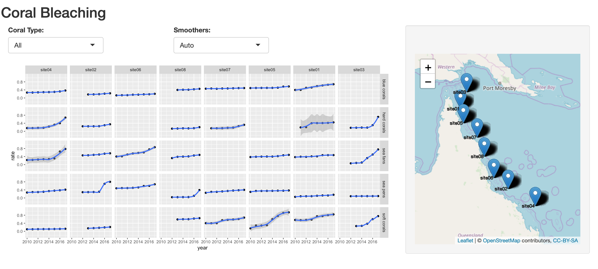

## Coral Bleaching Along The Great Barrier Reef

The project aims at wrangling and exploring spatial data whose results are shown on a map-based visualisation using <b>R Shiny</b> and <b>leaflet</b>. For this purpose, dataset regarding the rate of coral bleaching along the Great Barrier Reef, Australia is utilised.

The resulting interactive application, has two drop down menus at the top of the window from which the user can choose:
<ul>
  <li> To view the rate of coral bleach for a particular coral type - Blue Corals, Hard Corals, Sea Fans, Sea Pens, Soft Corals (or all). </li>
  <li> A smoothner - Linear Model, Generalised Linear Model, Generalised Additive Model, Loess Model (or an automatic one) along the trend line.</li>
</ul>

Immediately below this, is the plot showing the visulations based on the selection made and to the right is a leaflet map displaying the locations of the coral bleached sites.

